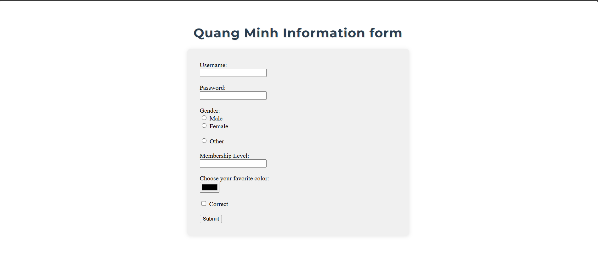

Exercise 1 & 2: Set up Flask, configure the environment, and create a static index.html page.
Exercise 3: Build a Student Information Form (e.g., "Viet Vu Information Form"), handle user input, and display submitted data.
Result of Lab1 exercises:

Exercise3:

